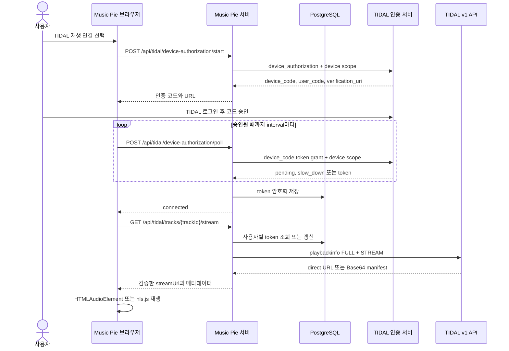

# TIDAL 전체 재생은 어떻게 구현되어 있는가

Music Pie의 전체 재생은 로그인한 사용자가 TIDAL Device Code 인증을 완료하면 서버가 `FULL` playback manifest를 조회하고, 브라우저가 `HTMLAudioElement` 또는 `hls.js`로 스트림을 재생하는 구조다. TIDAL access token과 refresh token은 서버와 DB 안에서만 다루며 브라우저에는 전달하지 않는다.

이 문서는 2026-09-21에 실제 계정으로 확인한 구현을 기준으로 인증, 토큰 보관과 갱신, 스트림 해석, 플레이어 상태 전이, 오류 코드, 운영 점검 방법을 설명한다.

## 전체 흐름



재생 버튼을 누른 뒤에는 다음 순서로 동작한다.

1. `MusicSessionProvider`가 큐의 트랙과 `referenceId`를 선택하고 재생 상태를 `loading`으로 바꾼다.
2. 브라우저 재생 엔진이 서버의 stream API를 호출한다.
3. 서버는 Auth0 세션의 `sub`로 해당 사용자의 TIDAL 연결만 조회한다.
4. token 만료가 60초 이내라면 서버가 refresh token으로 access token을 갱신한다.
5. 서버는 TIDAL `playbackinfo`에 `playbackmode=STREAM`과 `assetpresentation=FULL`을 요청한다.
6. 서버는 응답 manifest가 전체 재생이며 암호화되지 않은 direct/HLS 형식인지 검사한다.
7. 브라우저는 native HLS를 먼저 사용하고, 지원하지 않는 브라우저에서는 `hls.js`를 사용한다.
8. `playing`, `pause`, `waiting`, `timeupdate`, `durationchange`, `ended`, `error` 이벤트를 전역 재생 상태에 반영한다.
9. `ended` 이벤트가 발생하면 큐와 반복 모드에 따라 현재 곡, 다음 곡 또는 첫 곡을 새로 불러온다.

## 인증을 두 경로로 분리한 이유

일반 TIDAL OAuth client는 검색과 플레이리스트 같은 카탈로그 API에 사용한다. 전체 재생에 필요한 Device Code 인증은 TIDAL이 Limited Input Device 용도로 허용한 별도 client가 필요하다. 일반 client로 Device Code 시작을 시도하면 provider sub-status `1002`가 반환됐다.

| 경로 | 설정 | 용도 |
|---|---|---|
| Authorization Code + PKCE | `TIDAL_CLIENT_ID`, `TIDAL_CLIENT_SECRET`, `TIDAL_SCOPES` | 검색, 플레이리스트, 사용자 연결 |
| Device Code | `TIDAL_DEVICE_CLIENT_ID`, `TIDAL_DEVICE_CLIENT_SECRET`, `TIDAL_DEVICE_SCOPES` | `FULL` 스트림 재생 세션 |

`toTidalDeviceOAuthConfig()`는 Device client 설정이 있으면 이를 사용하고, 없으면 일반 client로 폴백한다. 폴백은 로컬 개발 편의를 위한 동작이며 일반 client가 Device Code 권한을 가진다는 의미는 아니다.

현재 기본 Device scope는 다음과 같다.

```dotenv
TIDAL_DEVICE_SCOPES=r_usr w_usr w_sub
```

실제로 동작한 세션의 DB scope와 JWT `scope` claim은 모두 `w_usr w_sub r_usr`였다. `hasTidalDeviceSessionScopes()`는 이 세 scope를 모두 가진 세션 또는 `r_stream`을 가진 세션을 재생 가능 세션으로 인정한다. scope 비교는 공백과 쉼표를 모두 구분자로 처리하며 순서에는 의존하지 않는다.

## Device Code 인증

### 인증 시작

`POST /api/tidal/device-authorization/start`는 먼저 Auth0 세션을 확인한다. 로그인하지 않았으면 `401 unauthorized`를 반환한다.

서버는 TIDAL의 `device_authorization` endpoint에 `client_id`와 `TIDAL_DEVICE_SCOPES`를 전송한다. 성공 응답에서 다음 값만 브라우저로 전달하며 응답에는 `cache-control: no-store`를 설정한다.

```json
{
  "deviceCode": "provider-issued-device-code",
  "userCode": "ABCDEF",
  "verificationUri": "https://provider.example/activate",
  "verificationUriComplete": "https://provider.example/activate?user_code=ABCDEF",
  "expiresAt": "2026-09-21T00:00:00.000Z",
  "intervalSeconds": 5
}
```

provider가 Limited Input Device client가 아니라고 판정하면 `409 tidal_device_client_unsupported`를 반환한다. 그 외 인증 시작 실패는 `502 tidal_device_authorization_failed`로 정규화한다.

### 승인 상태 확인

브라우저는 응답의 `intervalSeconds` 후 `POST /api/tidal/device-authorization/poll`을 호출한다. 요청 본문은 서버가 직전에 발급한 `deviceCode`만 포함한다.

```json
{
  "deviceCode": "provider-issued-device-code"
}
```

서버는 token endpoint에 Device Code grant와 승인 시작 때 사용한 동일한 scope를 보낸다. `authorization_pending`은 HTTP `202`로 유지하고, `slow_down`이면 다음 poll 간격에 5초를 더한다. 연결되면 암호화 저장을 마친 뒤 `{ "status": "connected" }`만 반환한다.

TIDAL token 응답이 `scope`를 생략하는 경우가 있으므로 요청한 `TIDAL_DEVICE_SCOPES`를 저장값으로 사용한다. 이 폴백이 없으면 유효한 Device token도 다음 stream 요청에서 `tidal_stream_scope_required`로 오판할 수 있다.

### 인증 모달의 수명 주기

`TidalDeviceAuthorization`은 모달을 `document.body`에 portal로 렌더링한다. 하단 플레이어에 적용된 `backdrop-filter`가 내부 `position: fixed`의 containing block이 되어 모달을 플레이어 높이로 잘라내는 문제를 이 방식으로 피한다.

poll이 `connected`를 받으면 예약된 timeout 참조를 비우고 모달을 닫은 뒤 `onConnected`를 호출한다. 사용자가 닫기 버튼을 누르거나 컴포넌트가 unmount될 때도 timeout을 해제한다.

## 토큰 저장과 갱신

Device token은 `tidal_connections`의 다음 열에 저장한다.

| 열 | 저장 내용 |
|---|---|
| `encrypted_access_token` | `TOKEN_ENCRYPTION_KEY`로 암호화한 access token |
| `encrypted_refresh_token` | refresh token이 있을 때 암호화한 값 |
| `access_token_expires_at` | 발급 시각과 `expires_in`으로 계산한 만료 시각 |
| `scope` | provider 응답 scope 또는 요청한 Device scope |
| `tidal_user_id` | provider가 반환한 TIDAL 사용자 ID |
| `status` | 정상 연결이면 `connected` |

연결은 `app_users.auth0_subject`를 기준으로 사용자별 한 건만 조회하고 갱신한다. 다른 사용자의 token이나 재생 상태를 섞지 않는다.

`getUsableTidalAccessToken()`은 만료까지 60초보다 많이 남았으면 복호화한 현재 access token을 반환한다. 60초 이내라면 다음 규칙으로 갱신한다.

1. 동일 `auth0_subject`의 동시 refresh 요청을 프로세스 내부 promise map으로 직렬화한다.
2. DB transaction에서 대상 연결을 `FOR UPDATE`로 잠근다.
3. 앞선 요청이 이미 갱신했는지 만료 시각을 다시 확인한다.
4. 저장 scope가 Device 세션 scope이면 Device client로 refresh하고, 그렇지 않으면 일반 OAuth client를 사용한다.
5. 회전된 access token과 refresh token을 다시 암호화해 저장한다.
6. provider가 새 refresh token 또는 scope를 생략하면 기존 값을 유지한다.

이중 직렬화는 같은 Node.js 프로세스 안의 중복 요청과 DB를 공유하는 여러 프로세스의 동시 요청을 모두 줄인다.

## 스트림 API

브라우저가 호출하는 endpoint는 다음 하나다.

```http
GET /api/tidal/tracks/{trackId}/stream?quality=HI_RES_LOSSLESS
```

`trackId`는 숫자로만 구성되어야 한다. `quality`를 생략하면 `HI_RES_LOSSLESS`를 사용하며 허용값은 `LOW`, `HIGH`, `LOSSLESS`, `HI_RES`, `HI_RES_LOSSLESS`다. 이는 최고 음질을 요청한다는 뜻이며 실제 반환 음질은 계정, 트랙, 국가와 TIDAL 응답에 따라 낮아질 수 있다.

서버가 TIDAL에 보내는 핵심 query는 다음과 같다.

```text
audioquality=HI_RES_LOSSLESS
playbackmode=STREAM
assetpresentation=FULL
countryCode=KR
```

국가 코드는 access token JWT의 `cc` claim, 호출 옵션, `TIDAL_COUNTRY_CODE`, 기본값 `US` 순서로 선택한다. playback API base URL은 `TIDAL_PLAYBACK_API_BASE_URL`이 있으면 사용하고 기본값은 `https://api.tidal.com/v1`이다.

### manifest 해석 규칙

TIDAL 응답의 `manifest`는 HTTPS URL이거나 Base64로 인코딩된 JSON이다. 서버는 두 형식을 모두 처리하고 `manifest.url` 또는 `manifest.urls`의 첫 HTTPS URL을 선택한다.

다음 조건을 모두 만족할 때만 브라우저에 반환한다.

- `assetPresentation`이 `FULL`이다.
- stream URL이 `https://`로 시작한다.
- `encryptionType`이 없거나 `NONE`이다.
- MIME type과 URL이 DASH/MPD 형식이 아니다.
- direct audio 또는 HLS로 브라우저에서 재생할 수 있다.

정상 응답의 형태는 다음과 같다.

```json
{
  "assetPresentation": "FULL",
  "audioQuality": "HIGH",
  "codec": "mp4a.40.2",
  "durationSeconds": 320,
  "manifestMimeType": "application/vnd.apple.mpegurl",
  "streamUrl": "https://media-provider.example/path/playlist.m3u8"
}
```

응답에는 TIDAL access token, refresh token, client secret, provider 원본 응답을 넣지 않는다. route 응답도 `cache-control: no-store`를 사용한다.

## 브라우저 재생 엔진

`createTidalPlaybackEngine()`은 트랙을 불러올 때 기존 HLS instance와 audio element를 정리한 뒤 새 stream URL을 요청한다. 각 load에 증가하는 `generation` 값을 부여해서 늦게 도착한 이전 요청이나 이벤트가 현재 재생 상태를 덮어쓰지 못하게 한다.

| 입력 또는 media event | Music Pie 동작 |
|---|---|
| `load(track, source)` | stream API 호출, audio/HLS 연결, duration과 transition 전파 |
| `play()` | `HTMLAudioElement.play()` 호출 |
| `pause()` | 현재 audio 일시 정지 |
| `seek(seconds)` | 0과 실제 duration 사이로 값을 제한한 뒤 `currentTime` 변경 |
| `setVolume(level)` | 0부터 100까지 제한하고 audio volume을 0부터 1로 변환 |
| `playing` | 전역 상태를 `playing`으로 변경 |
| `pause` | 종료 이벤트가 아닐 때 전역 상태를 `paused`로 변경 |
| `waiting` | 전역 상태를 `stalled`로 변경 |
| `timeupdate` | 재생 위치 갱신 |
| `durationchange` | 유효한 재생 시간 갱신 |
| `ended` | 현재 `referenceId`와 함께 큐 controller에 완료 통지 |
| `error` | `tidal_stream_media_error` 전파 |

HLS 여부는 manifest MIME type에 `mpegurl`이 포함되거나 URL이 `.m3u8`인지로 판정한다. 브라우저가 `application/vnd.apple.mpegurl`을 native로 재생할 수 있으면 audio element에 URL을 직접 지정하고, 그렇지 않으면 `hls.js`가 source를 load하고 media에 attach한다. fatal HLS 오류는 세부 오류 코드를 전역 상태에 전달한다.

`setNext()`는 현재 구현에서 스트림을 미리 발급하거나 media를 prefetch하지 않는다. signed stream URL의 수명과 불필요한 provider 호출을 줄이기 위해 `ended` 이후 큐 controller가 다음 트랙을 `load()`한다.

## 큐, 셔플, 반복 동작

`MusicSessionProvider`는 UI가 보는 큐 상태와 재생 엔진을 연결한다. 재생 가능한 트랙은 숫자 형태의 `tidalTrackId`가 있어야 한다.

- 트랙을 선택하면 해당 항목과 큐 index를 `loadItem()`에 전달하고 자동 재생한다.
- 다음 버튼은 다음 index를 불러오며 `repeat=all`인 마지막 곡에서는 첫 곡으로 이동한다.
- 이전 버튼은 이전 index를 불러오며 `repeat=all`인 첫 곡에서는 마지막 곡으로 이동한다.
- `repeat=one`에서 곡이 끝나면 같은 index를 다시 불러온다.
- `repeat=off`에서 마지막 곡이 끝나면 엔진을 reset하고 상태를 `finished`로 바꾼다.
- 셔플은 현재 곡을 첫 항목으로 유지한 채 나머지 큐 순서를 바꾼다.
- 모든 transition과 ended event는 `referenceId`를 비교해 이전 트랙에서 늦게 도착한 이벤트를 무시한다.

하단 플레이어와 전체 플레이어는 같은 provider 상태를 사용하므로 재생, seek, 볼륨, 음소거, 큐 index가 두 UI에서 일치한다.

## 오류 코드와 대응

| HTTP | `code` | 의미 | 사용자 또는 운영자 대응 |
|---:|---|---|---|
| 401 | `unauthorized` | Auth0 세션이 없음 | Music Pie에 다시 로그인한다. |
| 400 | `invalid_device_code` | poll 요청에 device code가 없음 | 인증을 처음부터 다시 시작한다. |
| 409 | `tidal_device_client_unsupported` | Device Code를 지원하지 않는 client | Limited Input Device client 설정을 확인한다. |
| 409 | `tidal_device_authorization_required` | 연결 또는 저장 token을 사용할 수 없음 | `TIDAL 재생 연결`로 다시 승인한다. |
| 409 | `tidal_stream_scope_required` | 저장 scope와 JWT claim 모두 재생 scope 조건을 충족하지 않음 | 실행 중 build와 Device scope를 확인한 뒤 다시 승인한다. |
| 409 | `tidal_full_playback_unavailable` | provider가 `FULL`이 아닌 asset을 반환 | 계정, 지역, 트랙 권한을 확인한다. Preview를 전체 재생으로 취급하지 않는다. |
| 415 | `tidal_stream_format_unsupported` | 암호화 또는 DASH stream | 현재 엔진에서 재생하지 않는다. DRM을 우회하지 않는다. |
| 502 | `tidal_device_authorization_failed` | Device 인증 provider 오류 | TIDAL 인증 endpoint와 client 설정을 확인한다. |
| 502 | `tidal_playback_upstream_failed` | playbackinfo 실패, 잘못된 track ID, quality 또는 manifest | 서버 로그에서 token 값과 URL을 제외한 상태 코드만 확인한다. |
| UI | `tidal_stream_media_error` | 브라우저 media element 오류 | 네트워크, codec, 만료된 signed URL 여부를 확인하고 트랙을 다시 load한다. |

`PersistentPlayer`는 `tidal_device_authorization_required`와 `tidal_stream_scope_required`를 받으면 `TIDAL 재생 연결` 버튼을 표시한다.

## 환경 변수

```dotenv
TOKEN_ENCRYPTION_KEY=
TIDAL_CLIENT_ID=
TIDAL_CLIENT_SECRET=
TIDAL_SCOPES=playlists.read search.read playback user.read
TIDAL_DEVICE_CLIENT_ID=
TIDAL_DEVICE_CLIENT_SECRET=
TIDAL_DEVICE_SCOPES=r_usr w_usr w_sub
TIDAL_TOKEN_URL=https://auth.tidal.com/v1/oauth2/token
TIDAL_DEVICE_AUTHORIZATION_URL=https://auth.tidal.com/v1/oauth2/device_authorization
TIDAL_PLAYBACK_API_BASE_URL=https://api.tidal.com/v1
TIDAL_COUNTRY_CODE=KR
```

`TIDAL_DEVICE_CLIENT_SECRET`, `TOKEN_ENCRYPTION_KEY`, access token, refresh token, Device Code, signed stream URL을 저장소나 문서, 브라우저 로그, 서버 로그에 기록하지 않는다. 실제 값은 `.env.local` 또는 운영 비밀 관리 시스템에만 둔다.

## 코드 책임 지도

| 경로 | 책임 |
|---|---|
| `apps/web/src/lib/tidal/oauth.ts` | 일반 OAuth와 Device OAuth 설정, token 교환과 refresh, Device scope 판정 |
| `apps/web/src/lib/tidal/device-authorization.ts` | Device Code 시작, poll, provider 응답 정규화 |
| `apps/web/src/app/api/tidal/device-authorization/start/route.ts` | 로그인 검사와 인증 시작 HTTP 계약 |
| `apps/web/src/app/api/tidal/device-authorization/poll/route.ts` | poll HTTP 계약과 연결된 token 저장 |
| `apps/web/src/lib/db/user-connections.ts` | 사용자별 token 암호화 저장, 복호화, 동시 refresh 제어 |
| `apps/web/src/lib/tidal/playback-stream.ts` | scope 검사, playbackinfo 요청, manifest 검증과 정규화 |
| `apps/web/src/app/api/tidal/tracks/[trackId]/stream/route.ts` | 브라우저용 stream API와 오류 상태 매핑 |
| `apps/web/src/lib/tidal/player.ts` | `HTMLAudioElement`와 `hls.js` 재생 엔진 |
| `apps/web/src/providers/music-session-provider.tsx` | 큐, 셔플, 반복, 이전/다음, 재생 상태 조정 |
| `apps/web/src/components/player/tidal-device-authorization.tsx` | Device Code 모달, poll scheduling, 연결 완료 처리 |
| `apps/web/src/components/player/persistent-player.tsx` | 하단 플레이어와 재인증 진입점 |

## 배포 후 점검

코드를 바꾼 뒤에는 실행 중인 production 서버가 새 build를 사용하는지 확인한다. 이전 서버가 살아 있으면 소스만 수정해도 scope 처리와 UI 수정이 적용되지 않는다.

```powershell
Set-Location C:\Wspace\music-pie\apps\web
npm test
npm run lint
npm run build
npm run start -- -p 44119
```

Cloudflare Tunnel을 사용하는 환경에서는 별도 PowerShell에서 다음을 실행한다.

```powershell
cloudflared tunnel run music-pie
curl.exe -I http://127.0.0.1:44119
curl.exe -I https://mrms.approid.team
```

두 HTTP 요청이 모두 `200 OK`를 반환해야 한다. 실제 사용자 흐름은 다음 순서로 점검한다.

1. 검색 결과에서 재생 가능한 TIDAL 트랙을 선택한다.
2. 연결 오류가 표시되면 `TIDAL 재생 연결`을 열고 TIDAL에서 코드를 승인한다.
3. 승인 후 모달이 자동으로 닫히는지 확인한다.
4. 트랙이 `일시 정지` 버튼 상태로 바뀌고 재생 시간이 증가하는지 확인한다.
5. seek bar를 이동한 뒤 새 위치에서 계속 재생되는지 확인한다.
6. 다음 곡 버튼과 자연 종료가 큐의 다음 곡을 불러오는지 확인한다.
7. 개발자 도구와 서버 로그에 token 또는 전체 signed stream URL이 노출되지 않았는지 확인한다.

## 장애 진단

### 재승인했는데 `tidal_stream_scope_required`가 반복된다

먼저 실행 중인 서버가 최신 build인지 확인한다. 이 구현 과정에서는 이전 production 프로세스가 일반 OAuth scope를 다시 저장해 같은 오류가 반복된 적이 있었다. 새 build로 재시작한 뒤 다시 승인했고 DB에는 `w_usr w_sub r_usr`가 저장됐다.

DB를 확인할 때는 `status`, `scope`, `access_token_expires_at`, `updated_at` 같은 메타데이터만 조회한다. 암호화 token 값도 출력하거나 복사하지 않는다. 저장 scope와 JWT claim 중 하나라도 허용 조건을 충족하면 stream 요청은 통과한다.

### 인증 완료 후 모달이 남는다

현재 코드는 `connected` 응답에서 timeout을 정리하고 `setIsOpen(false)`를 호출한다. 문제가 다시 발생하면 브라우저 Network 패널에서 poll 응답이 실제로 HTTP `200`과 `{ "status": "connected" }`인지 확인한 뒤 실행 중 build를 확인한다.

### 인증 모달이 하단 플레이어 안에서 잘린다

현재 모달은 `createPortal(..., document.body)`로 렌더링되어야 한다. DOM에서 dialog가 `<aside>` 내부에 있다면 이전 build가 실행 중이다.

### 공개 주소가 Cloudflare 오류 `1033`을 반환한다

`127.0.0.1:44119`의 production 서버와 `music-pie` tunnel connector가 모두 실행 중인지 확인한다. 원본 서버와 tunnel 중 하나만 실행해도 공개 주소는 정상 동작하지 않는다.

### 일부 트랙만 전체 재생되지 않는다

계정 구독, 국가, 트랙 권리 상태에 따라 provider가 `FULL` asset을 주지 않을 수 있다. 앱은 preview를 전체 재생으로 대체하지 않고 `tidal_full_playback_unavailable`을 반환한다. 암호화되거나 DASH인 manifest도 현재 지원 범위 밖이다.

## 검증 기록

2026-09-21에 다음 항목을 확인했다.

- Device client로 Device Code 시작 요청이 HTTP `200`을 반환했다.
- 승인 전 token poll이 `authorization_pending`을 반환했다.
- 승인 후 발급 token과 JWT claim에 `w_usr w_sub r_usr`가 포함됐다.
- 트랙 `5761228`의 playbackinfo가 HTTP `200`, `assetPresentation=FULL`, `audioQuality=HIGH`, manifest 포함 응답을 반환했다.
- 공개 주소에서 `One More Time` 재생이 시작되고 `0:01 / 5:20`, 일시 정지 버튼 상태, media 오류 없음이 확인됐다.
- 사용자가 인증 모달 자동 닫힘, 전체 재생, seek, 다음 곡 전환이 모두 동작한다고 확인했다.
- 관련 회귀를 포함한 Vitest 50개 파일·172개 테스트, ESLint, production build가 통과했다.

위 실제 재생 검증은 기본 음질을 `LOSSLESS`에서 `HI_RES_LOSSLESS`로 변경하기 전에 수행했다. 변경 후 자동화 테스트와 production build는 통과했으며 실제 계정이 반환하는 음질은 다시 확인해야 한다.

## 알려진 제약

- `https://api.tidal.com/v1/tracks/{trackId}/playbackinfo`는 현재 동작을 확인한 legacy endpoint다. provider가 계약을 바꾸면 구현을 다시 검증해야 한다.
- DRM, DASH/MPD, 암호화 manifest는 지원하지 않는다.
- fixture 기반 EMS 트랙처럼 숫자 `tidalTrackId`가 없는 항목은 실제 스트리밍 대상이 아니다.
- 실제 모바일 기기의 codec 지원과 백그라운드 오디오 동작은 아직 검증하지 않았다.
- signed stream URL은 영구 URL로 저장하지 않으며 트랙을 load할 때마다 서버에서 새로 해석한다.

## 관련 기록

- `docs/superpowers/specs/2026-09-21-tidal-device-stream-playback-design.md`
- `docs/superpowers/plans/2026-09-21-tidal-device-stream-playback.md`
- `docs/changes/2026-09-21-tidal-device-stream-playback.md`
- `docs/deployment/auth0-tidal-cloudflare-setup.md`
